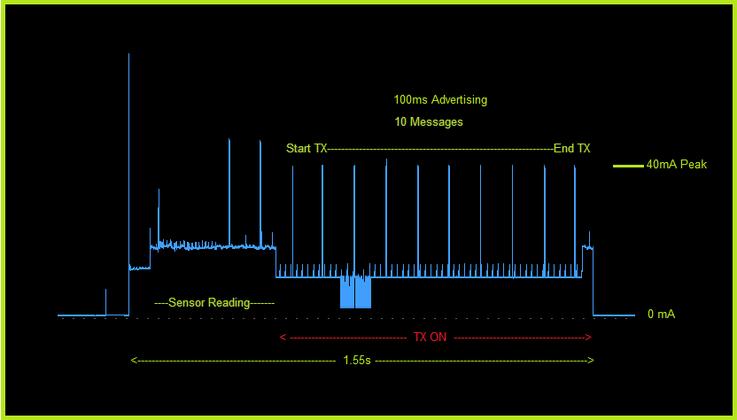

# __IBEACON Sensor with 10 years battery life.__
------------------------------------------------
**BME680** temperature, humidity, barometric pressure and gas sensor  
**TMP117x** High-Accuracy, Low-Power, Digital Temperature Sensor  
**TPL5110** Nano-Power System Timer for Power Gating  
**Blueduino** module from April Brother with TI CC2540: [April_Brother](https://www.aprbrother.com/en/index.htm)  
One 14500 Lithium Ion battery (3.6v)  

**Battery Life** : 10 Years with 48 Messages per Day and 1500mAh battery  

-------------------------------------------------------------
# __Setup !__

Before using you must connect the module to USB port of your PC  
and configure it with the parameters below by using a the  
Serialpassthrough arduino sketch at 9600 baud.

```
AT+NAME=MYNAME  -> set module name  
AT+ADVI1        -> set 100ms advertising interval  
AT+POWR1        -> set power at +4dBm  
AT+ROLE0        -> set role as slave  
AT+RESET        -> reset module  
AT+BAUD1        -> set 19200 baud  
```

Once the ILT254s updated  you must use the SPI interface for programming
the ATMEGA32U4    
Flash the generated hex with the no-bootloader version.  
Disable BOOTRST FUSE (this accelerate start-up)  
Don't forget to update the UUID_SENSOR number in the "defs.h" for each module.

---

# __Ibeacon : UUID + MAJOR + MINOR__

#### Example : UUID = 2332A4C2-0201-0e44-04df-00f726ed014a

2332A4C2 = Sensor UUID prefix   
0201     = 02 Sensor Type, 01 Sensor Number  
0E44     = Battery voltage : 3.652V  
04df     = temperature from BME680 24.7°C   
00f7     = altitude in meter : 247m  
26ed     = pressure in Hpa : 996.5Hpa  
014a     = gaz resistor in Kohms : 330Kohms  
#### Example : MAJOR = 1247  (DECIMAL)
1245     = temperature from TMP117 : +24.5°C   
#### Example : MINOR = 4889 (DECIMAL)
4889     = Relative Humidity in % : 48.89%  

-----------------------------------------------------------------
# __Current Profile__  



Advertising time : 100ms  
10 Frame per message  
Average current : 13mA  
Power down Current 35nA  
Active Time : 1.55s  

# __Estimated Battery Life in Years__    

Below estimated battery life with different battery capacities.  


| Nb of Msg / Day | 230mAh | 1200 mAh | 1500 mAh | 2200 mAh |
|-----------------|--------|----------|----------|----------|
|        24       |   4.5  |    14    |   15.9   |   19.1   |
|        48       |   2.3  |    8.9   |   10.5   |   13.4   |
|        96       |   1.2  |    5.2   |    6.2   |    8.4   |
